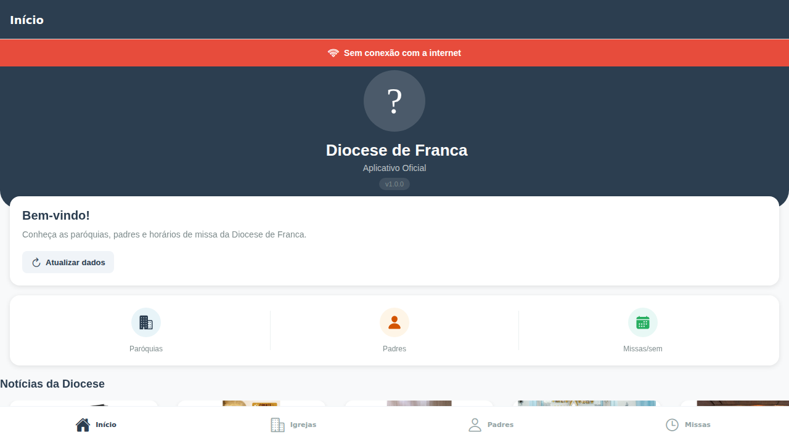
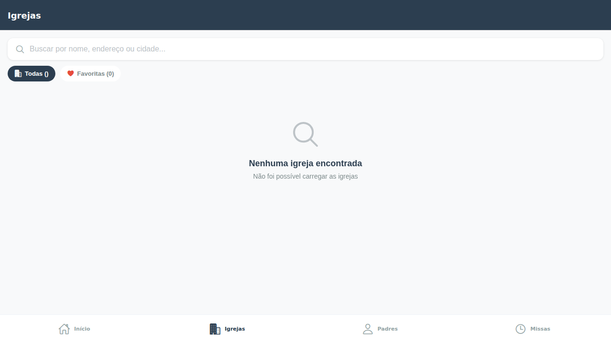

# Diocese de Franca - App

Aplicativo completo para a Diocese de Franca com backend API REST e app React Native.

> **Status: 100% Funcional e em Produção** - Tests: 19/19 passing

## Funcionalidades

### Backend API
- REST API com Express.js 5.x
- Compressão gzip e headers de segurança (Helmet)
- Health check endpoint para monitoramento
- Middleware de validação e tratamento de erros
- Respostas padronizadas com sucesso/erro
- **19 testes automatizados** cobrindo todos os endpoints

### Mobile App
- Interface moderna com design profissional
- **Pull-to-refresh** em todas as listas
- **Skeleton loaders** durante carregamento
- **Sistema de favoritos** persistente (AsyncStorage)
- **Toast notifications** para feedback de ações
- **Indicador de rede** offline/online
- Busca em tempo real com filtros
- Compartilhamento via Share API
- Estados de loading e erro tratados

## Novidades Implementadas

### Mobile
- Deploy web 100% funcional no Netlify com Metro bundler suportando `react-native-web`
- Notificações locais automáticas e agendadas diariamente (Leitura do Evangelho) via `expo-notifications` no HomeScreen
- Aprimoramentos de UI/UX para Empty States (Mensagem "Bem-vindo, Fiel!" e telas sem dados com ícones claros)
- Skeletons Loaders (Animação Shimmer) em diversas áreas como Notícias e Listas
- Correção de duplicação de variáveis na renderização do banner offline
- Pull-to-refresh com feedback visual
- Favoritos salvos localmente (persistem)
- Toast notifications animadas (success/error/info)
- Indicador de conexão em tempo real
- Filtro "Todos" vs "Favoritos" em Igrejas e Padres
- Botão de limpar filtros
- Seção de acesso rápido na home
- Badges de estatísticas clicáveis
- Testes E2E com Playwright para verificação no ambiente web

### Backend
- Scraper autônomo aprimorado (`backend/scraper.js`) prevenindo duplicidades e falhas nas imagens/textos
- Endpoint de health check `/api/health`
- Compressão gzip automática
- Helmet.js para headers de segurança
- Middleware de validação de ID e dia
- Logs de requisição com timestamp
- Tratamento centralizado de erros 404/500
- Respostas com wrapper `{ success, count, data }`

## Tecnologias

### Backend
- Node.js + Express.js 5.x
- CORS, Compression, Helmet
- Jest (19 testes)

### Mobile
- React Native (Expo SDK 54)
- React Navigation 7
- AsyncStorage (favoritos persistentes)
- @expo/vector-icons (Ionicons)
- Axios

## Estrutura do Projeto

```
diocese-franca-app/
├── backend/
│   ├── data/                    # Dados JSON
│   │   ├── churches.json
│   │   ├── priests.json
│   │   └── masses.json
│   ├── routes/                 # Rotas da API
│   │   ├── churches.js
│   │   ├── priests.js
│   │   └── masses.js
│   ├── middleware/             # Middleware Express
│   │   └── validation.js
│   ├── tests/                  # Testes automatizados
│   │   └── api.test.js
│   ├── index.js                # Entry point
│   └── package.json
│
└── mobile/
    ├── src/
    │   ├── components/          # Componentes reutilizáveis
    │   │   ├── NetworkStatus.js
    │   │   └── Skeleton.js
    │   ├── context/            # Contextos React
    │   │   ├── DataCacheContext.js
    │   │   └── ToastContext.js
    │   ├── navigation/         # Navegação
    │   │   └── index.js
    │   ├── screens/            # Telas do app
    │   │   ├── HomeScreen.js
    │   │   ├── ChurchesScreen.js
    │   │   ├── ChurchDetailScreen.js
    │   │   ├── PriestsScreen.js
    │   │   ├── PriestDetailScreen.js
    │   │   └── MassesScreen.js
    │   └── services/           # Serviços
    │       ├── api.js
    │       └── FavoritesService.js
    ├── App.js
    └── package.json
```

## Instalação e Execução

### Backend

```bash
cd backend
pnpm install
pnpm start
# Servidor: http://localhost:3000
```

### Mobile

```bash
cd mobile
pnpm install
pnpm start
```

### Executar Testes

```bash
cd backend
pnpm test
# Resultado: 19 testes passando
```

## Endpoints da API

| Método | Endpoint | Descrição |
|--------|----------|-----------|
| GET | `/` | Raiz da API |
| GET | `/api/health` | Health check |
| GET | `/api/churches` | Lista todas as igrejas |
| GET | `/api/churches/:id` | Detalhes de uma igreja |
| GET | `/api/priests` | Lista todos os padres |
| GET | `/api/priests/:id` | Detalhes de um padre |
| GET | `/api/masses` | Lista todos os horários |
| GET | `/api/masses/by-church/:id` | Missas por igreja |
| GET | `/api/masses/by-day/:dia` | Missas por dia |
| GET | `/api/news` | Notícias da Diocese (scraped) |

## Funcionalidades do App Detalhadas

### Tela Início
- Dashboard com estatísticas (paróquias, padres, missas)
- **NOVO:** Sessão "Notícias da Diocese" que exibe os destaques raspados diretamente do portal da Diocese com imagens e links
- Cards clicáveis para navegação rápida
- Seção de acesso rápido (Missa domingo, **Lembrete diário com notificações locais**, ligar, email)
- Pull-to-refresh para atualizar dados
- Informações de contato da diocese

### Igrejas
- Lista com busca em tempo real
- Filtro: Todos / Favoritos
- Avatar com ícone da igreja
- Botões de ação: favoritar, compartilhar
- Pull-to-refresh
- Skeleton loader durante carregamento

### Detalhes da Igreja
- Informações completas (endereço, telefone, descrição)
- Pároco responsável com contato
- Lista de horários de missa
- Botão para abrir no mapa

### Padres
- Lista com busca por nome/título
- Filtro: Todos / Favoritos
- Avatar com iniciais do nome
- Badge com título (Pároco, Bispo)
- Pull-to-refresh

### Detalhes do Padre
- Perfil com biografia
- Contato (email, telefone)
- Paróquia com navegação

### Horários de Missa
- Filtros por dia da semana
- Filtros por tipo (Dominical/Semanal)
- Botão limpar filtros
- Lista organizada por dia
- Badge com contador de missas
- Pull-to-refresh

## Dados

| Entidade | Quantidade |
|----------|------------|
| Paróquias | 4 |
| Padres | 5 |
| Missas/semana | 22 |

## Testes

O backend possui **19 testes automatizados** cobrindo:

- Validação de ID inválido (400)
- Busca de igreja/padre inexistente (404)
- Listagem com wrapper de sucesso
- Verificação de campos obrigatórios
- Filtro por dia da semana
- Case insensitive para dias
- Arrays vazios para dias sem missa

## Pré-requisitos

- Node.js 18+
- pnpm (gerenciador de pacotes)

```bash
npm install -g pnpm
```

## Screenshots

O app possui interface moderna com:
- Cores consistentes (#2c3e50 como primária)
- Cards com elevation e sombras suaves
- Ícones Ionicons em todas as ações
- Feedback visual em todas as interações
- Estados de loading com skeleton
- Toasts animados para feedback

### Screenshots (Web Output E2E Test)
**Home Screen**


**Igrejas Screen**


## Licença

ISC